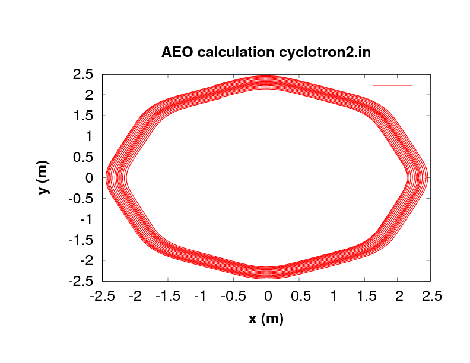

# Goal
Here we will run the Cyclotron flavour of OPAL (OPAL_cycl) in three distinct modes
1. tune calculation
2. accelerated orbit mode
3. 3D space charge calculation

# Preparation
This example is for OPAL 2.0.x and 1.6.x (see compatible versions in examples).
If you do not have already access to OPAL, you can visit the download page [the download page](downloads). In
case OPAL is on your cluster please check with the administrator how to use. PSI user please click [here](OPALAtPSI).

# Needed Input Files
For this project we need input files, that you obtain by clicking on links below:

1. [cyclotron1.in](/Cyclotron/cyclotron1.in) and [cyclotron2.in](Cyclotron/cyclotron2.in) ([cyclotron1.in]( Cyclotron/1.6/cyclotron1.in) and [cyclotron2.in]( Cyclotron/1.6/cyclotron2.in) for 1.6.x) the OPAL input files
2. [bfield.dat]( Cyclotron/bfield.dat) (magnetic field map)
3. [rffield1.dat]( Cyclotron/rffield1.dat) and [rffield2.dat](Cyclotron/rffield2.dat) (rf field maps)
4. [dist1.dat]( Cyclotron/dist1.dat) [dist2.dat]( Cyclotron/dist2.dat) (the input distributions)
5. [ic.dat]( Cyclotron/ic.dat) (initial conditions for the tune calculation)
6. [refsol.dat]( Cyclotron/refsol.dat) (the reference solution for the tune calculation)
7. [cyclotron1.gpl]( Cyclotron/cyclotron1.gpl) and [cyclotron2.gpl]( Cyclotron/cyclotron2.gpl) (plotting scripts for gnuplot)

# Tune Calculation using cyclotron1.in
### Needed files: cyclotron1.{in,bash,gpl}, bfield.dat, dist1.dat, ic.dat & refsol.dat

For the tune calculation we need initial conditions (ic):  energy, radius and radial momenta given to us by an other program in the file  ic.dat.
The Bash script [cyclotron1.bash](Cyclotron/cyclotron1.bash) will run the tune calculation for all energies specified in ic.dat and store the
radial and vertical tune values together with reference data.
Make sure the script has execute permission (`chmod u+x cyclotron1.bash`).
A comparison can be plotted with [gnuplot](http://www.gnuplotting.org), by executing

`gnuplot cyclotron1.gpl`

The result is saved in cyclotron1.pdf and shown below.

# Accelerated Orbit Calculation using cyclotron2.in
### Needed files: cyclotron2.{in,gpl}, bfield.dat, dist2.dat, rffield1.dat & rffield2.dat
For this calculation the initial conditions are set in the input file. Run OPAL with

`opal cyclotron2.in | tee cyclotron2.out`

where you also save the output in cyclotron2.out. It is always a good idea to check the standard output of OPAL in order to reveal problems.

`gnuplot cyclotron2.gpl`

As in the previous example, the result is saved in cyclotron2.pdf and shown below.

# 3D space charge calculation
### Under construction

In cyclotron2.in, only the distribution and beam command, together with the field solver needs to be adapted.

Dist1 as defined here

**Dist1:DISTRIBUTION, DISTRIBUTION=GAUSS**

**sigmax=3E-3, sigmapx=1E-5,**

**sigmay=3E-3, sigmapy=1E-5,**

**sigmat=3E-3, sigmapt=1E-5,**

**CORRX = 0,  CORRY =0,  CORRT = 0;**

represents a beam with 3 mm rms. The field solver **Fs1** is the standard open domain FFT solver:

**Fs1:FIELDSOLVER, FSTYPE=FFT, MX=64, MY=64, MT=64, PARFFTX=true, PARFFTY=true, PARFFTT=false,  BCFFTX=open, BCFFTY=open, BCFFTT=open;**

and the beam is represented by **1E5** macro particles

**Beam1: BEAM, PARTICLE=PROTON, pc=P0, NPART=1E5, BCURRENT=1.0E-6, CHARGE=1.0, BFREQ= f1;**

