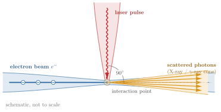
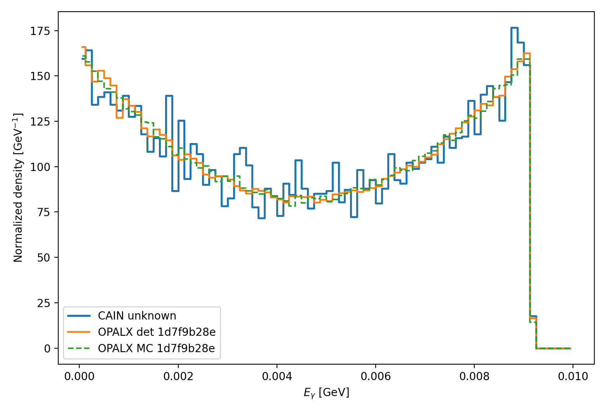
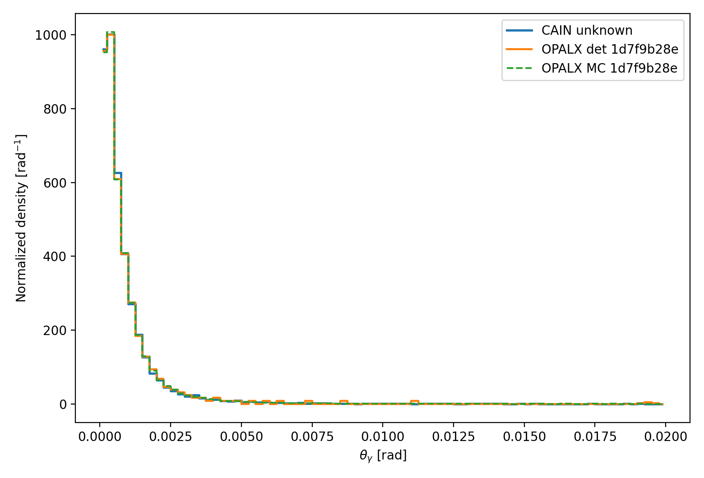
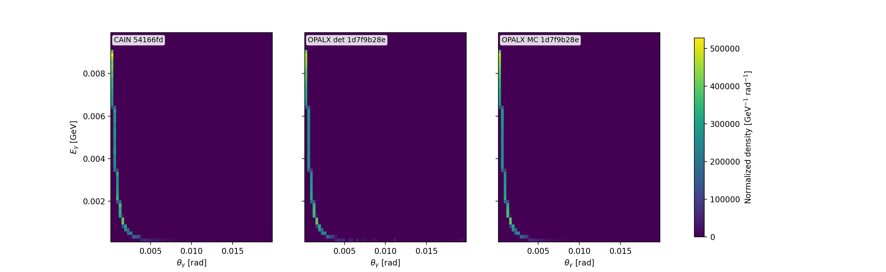
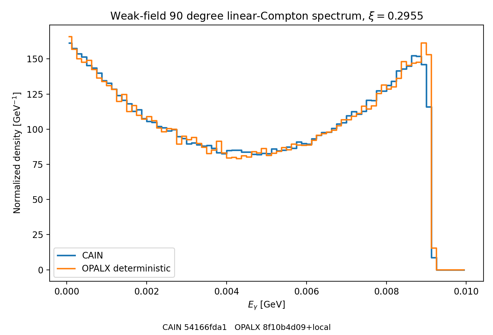
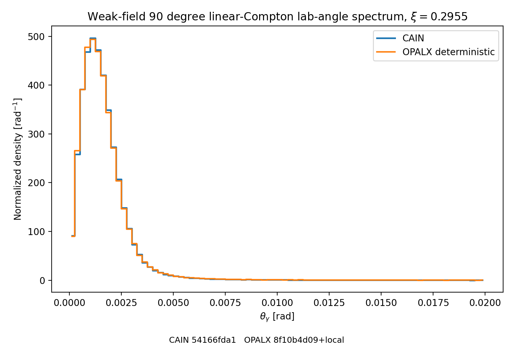
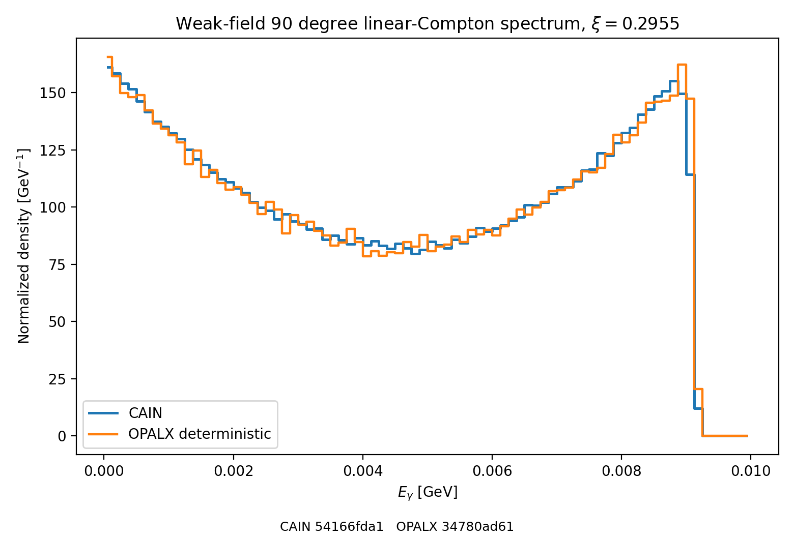
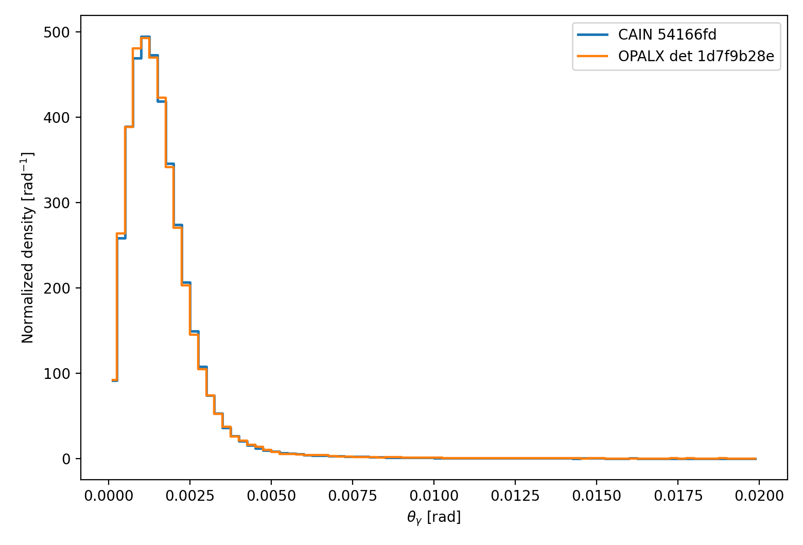

:stem: latexmath
:eqnums:
:docinfo: shared

== Linear Compton Benchmark

=== Scope

We consider a single ultra-relativistic electron with total energy latexmath:[E_e]
and rest mass latexmath:[m_e]. The electron moves along latexmath:[+\hat z].

The laser is represented by a single photon with wavelength latexmath:[\lambda_L]
and propagates along latexmath:[+\hat x]. This corresponds to a crossing angle of
latexmath:[90^\circ] between the beam and the laser.

The benchmark starts from the simplest fixed-geometry observables:

- the scattered-photon energy in the forward electron direction
- the scattered-photon polar angle in the laboratory frame relative to the beam

The present benchmark follows the conventions used in the OPALX source, electron and photon energies are expressed in `GeV`
wavelength is expressed in `m`, the speed of light latexmath:[c] and the reduced Planck constant latexmath:[\hbar] are taken from `Physics.h`

=== Physics Models

==== Laser Photon Energy

For a laser wavelength latexmath:[\lambda_L], the photon energy is

[latexmath]
++++
\omega_L = \frac{2 \pi \hbar c}{\lambda_L}.
++++

This is the same expression used in the current `Laser` helper in OPALX.

==== Exact 90 Degree Kinematics

The incoming electron momentum magnitude is

[latexmath]
++++
p_e = \sqrt{E_e^2 - m_e^2}.
++++

For the 90 degree crossing geometry, the linear Compton invariant used by the
current OPALX helper reduces to

[latexmath]
++++
x = \frac{2 E_e \omega_L}{m_e^2}.
++++

For a photon emitted in the forward electron direction, exact energy-momentum
conservation gives

[latexmath]
++++
\omega_\gamma' =
\frac{E_e \, \omega_L}
     {E_e - p_e + \omega_L}.
++++

For relativistic electrons the term latexmath:[E_e - p_e] is numerically small, so
the equivalent but more stable form is preferred in code and tests:

[latexmath]
++++
\omega_\gamma' =
\frac{E_e \, \omega_L}
     {\omega_L + \frac{m_e^2}{E_e + p_e}}.
++++

==== Unpolarized Differential Kernel

The exact linear Compton spectrum is most compactly written in the electron rest
frame. Let latexmath:[\omega_1] be the incoming photon energy in that frame and let
latexmath:[\Theta^*] be the scattering angle between the incoming and outgoing
photon directions.

The scattered photon energy is

[latexmath]
++++
\omega_2(\Theta^*) =
\frac{\omega_1}
     {1 + (\omega_1/m_e)(1 - \cos \Theta^*)}.
++++

The unpolarized Klein-Nishina differential cross section is

[latexmath]
++++
\frac{d\sigma}{d\Omega^*}
= \frac{r_e^2}{2}
  \left(\frac{\omega_2}{\omega_1}\right)^2
  \left(
    \frac{\omega_1}{\omega_2}
    +
    \frac{\omega_2}{\omega_1}
    - \sin^2 \Theta^*
  \right).
++++

Integrating over the azimuthal angle and changing variables from
latexmath:[\cos \Theta^*] to latexmath:[\omega_2] gives the one-dimensional
energy spectrum in the electron rest frame,

[latexmath]
++++
\frac{d\sigma}{d\omega_2}
= 2\pi \frac{d\sigma}{d\Omega^*} \frac{m_e}{\omega_2^2}.
++++

Its exact support is
latexmath:[\omega_2 \in [\omega_1/(1+2\omega_1/m_e),\,\omega_1]].

The exact total Klein-Nishina cross section can be written with
latexmath:[\kappa = \omega_1/m_e] as

[latexmath]
++++
\sigma_{\mathrm{KN}} = 2\pi r_e^2
\left[
  \frac{1+\kappa}{\kappa^3}
  \left(
    \frac{2\kappa(1+\kappa)}{1+2\kappa} - \ln(1+2\kappa)
  \right)
  + \frac{\ln(1+2\kappa)}{2\kappa}
  - \frac{1+3\kappa}{(1+2\kappa)^2}
\right].
++++

For latexmath:[\kappa \ll 1] this approaches the Thomson limit

[latexmath]
++++
\sigma_T = \frac{8\pi}{3} r_e^2,
++++

and the OPALX implementation uses a low-energy expansion around this limit to
avoid cancellation in the exact closed form.

The current helper and test suite enforce the normalization identity

[latexmath]
++++
\int_{\omega_{2,\min}}^{\omega_{2,\max}} \frac{d\sigma}{d\omega_2} \, d\omega_2
= \sigma_{\mathrm{KN}}.
++++

==== Rest-Frame Mapping

CAIN evaluates the linear Compton kinematics by boosting the laser photon into
the electron rest frame, applying the Compton recoil there, and boosting the
scattered photon back to the laboratory frame.

In the CAIN source this appears in the linear Compton generator `LNCPGN`, where
the incoming laser photon energy in the electron rest frame is

[latexmath]
++++
\omega_1 = \gamma \, \omega_L \, (1 - \beta \cos \alpha),
++++

with crossing-angle cosine latexmath:[\cos \alpha].

For the present benchmark latexmath:[\cos \alpha = 0], so

[latexmath]
++++
\omega_1 = \gamma \, \omega_L.
++++

For the present benchmark the incoming laser direction in the electron rest
frame is not collinear with the electron boost axis. If the outgoing photon is
required to be forward in the laboratory frame, then its direction in the
rest frame is along latexmath:[+\hat z], while the angle between the incoming and
outgoing photons is

[latexmath]
++++
\cos \Theta^* = -\beta.
++++

This gives

[latexmath]
++++
\omega_2 =
\frac{\gamma \omega_L}
     {1 + (\gamma \omega_L/m_e)(1 + \beta)}.
++++

Boosting the scattered photon back to the laboratory frame in the forward
electron direction gives

[latexmath]
++++
\omega_\gamma' = \gamma (1 + \beta) \omega_2,
++++

which is algebraically equivalent to the stable laboratory-frame formula used in
the OPALX unit test.

=== Result of Code Comparison

The current implementation is intentionally narrow but already includes a
dedicated physics helper in `src/Physics/LinearCompton.*`:

- the `LASER` element stores the laser wavelength and direction
- `Physics::LinearCompton` computes the unpolarized single-electron linear
  Compton benchmark quantities
- the `LASER` benchmark methods delegate to `Physics::LinearCompton`
- unit tests verify the Thomson limit, exact recoil endpoints, spectrum
  normalization, the exact 90 degree forward-scattering benchmark, deterministic
  and fixed-seed weak-field CAIN energy-spectrum comparisons, and deterministic
  and fixed-seed weak-field CAIN lab-angle comparisons

Code references in the OPALX repository (`laser-element-1`) are

- link:https://github.com/OPALX-project/OPALX/blob/laser-element-1/src/Physics/LinearCompton.h[`src/Physics/LinearCompton.h`]
- link:https://github.com/OPALX-project/OPALX/blob/laser-element-1/src/Physics/LinearCompton.cpp[`src/Physics/LinearCompton.cpp`]
- link:https://github.com/OPALX-project/OPALX/blob/laser-element-1/unit_tests/Physics/TestLinearCompton.cpp[`unit_tests/Physics/TestLinearCompton.cpp`]
- link:https://github.com/OPALX-project/OPALX/blob/laser-element-1/unit_tests/Physics/TestLinearComptonSpectrum.cpp[`unit_tests/Physics/TestLinearComptonSpectrum.cpp`]
- link:https://github.com/OPALX-project/OPALX/blob/laser-element-1/unit_tests/Physics/LinearComptonSpectrumBenchmark.cpp[`unit_tests/Physics/LinearComptonSpectrumBenchmark.cpp`]

What is not included yet:

- finite pulse overlap
- luminosity integration
- photon bunch population
- polarization dependence
- nonlinear Compton effects
- Breit-Wheeler pair creation

The stored weak-field reference uses

- electron total energy: `1 GeV`
- laser wavelength: `1030 nm`
- crossing angle: latexmath:[90^\circ]
- unpolarized laser: `STOKES=(0,0,0)`
- single-electron geometry on the CAIN side: zero emittance and zero bunch length
- number of electron macro-particles: `900000`
- pulse energy: `0.029 J`
- CAIN weak-field parameter: latexmath:[\xi = 0.2955 < 0.3]
- resulting CAIN photon yield: about `1.17e4` photons

The stored histogram and plot references in this directory are

- `reference-data/cain-linear-compton-90deg-xi029-histogram.csv`
- `reference-data/opalx-linear-compton-90deg-xi029-histogram.csv`
- `reference-data/opalx-linear-compton-90deg-xi029-sampled-histogram.csv`
- `reference-data/cain-linear-compton-90deg-xi029-theta-histogram.csv`
- `reference-data/opalx-linear-compton-90deg-xi029-theta-histogram.csv`
- `reference-data/opalx-linear-compton-90deg-xi029-sampled-theta-histogram.csv`
- `reference-data/cain-linear-compton-90deg-xi029-joint-histogram.csv`
- `reference-data/opalx-linear-compton-90deg-xi029-joint-histogram.csv`
- `reference-data/opalx-linear-compton-90deg-xi029-sampled-joint-histogram.csv`
- `reference-data/cain-linear-compton-90deg-xi029-finite-beam-histogram.csv`
- `reference-data/opalx-linear-compton-90deg-xi029-finite-beam-histogram.csv`
- `reference-data/cain-linear-compton-90deg-xi029-finite-beam-theta-histogram.csv`
- `reference-data/opalx-linear-compton-90deg-xi029-finite-beam-theta-histogram.csv`
- `reference-data/cain-linear-compton-90deg-xi029-finite-beam-energy-spread-histogram.csv`
- `reference-data/opalx-linear-compton-90deg-xi029-finite-beam-energy-spread-histogram.csv`
- `reference-data/cain-linear-compton-90deg-xi029-finite-beam-energy-spread-theta-histogram.csv`
- `reference-data/opalx-linear-compton-90deg-xi029-finite-beam-energy-spread-theta-histogram.csv`
- `reference-data/linear-compton-90deg-xi029-comparison.png`
- `reference-data/linear-compton-90deg-xi029-theta-comparison.png`
- `reference-data/linear-compton-90deg-xi029-joint-comparison.png`
- `reference-data/linear-compton-90deg-xi029-finite-beam-comparison.png`
- `reference-data/linear-compton-90deg-xi029-finite-beam-theta-comparison.png`
- `reference-data/linear-compton-90deg-xi029-finite-beam-energy-spread-comparison.png`
- `reference-data/linear-compton-90deg-xi029-finite-beam-energy-spread-theta-comparison.png`

The energy histograms use columns

- `center_GeV`
- `density_per_GeV`
- `count`

The angular histograms use columns

- `center_rad`
- `density_per_rad`
- `count`

The joint histograms use columns

- `energy_center_GeV`
- `theta_center_rad`
- `density_per_GeV_rad`
- `count`

For the current stored single-electron references, the CAIN-to-OPALX agreement is:

- energy spectrum, deterministic: mean difference about `0.5%`, L1 distance about `0.0767`
- energy spectrum, sampled: mean difference about `0.45%`, L1 distance about `0.0763`
- lab-angle spectrum, deterministic: mean difference about `4.0%`, L1 distance about `0.0400`
- lab-angle spectrum, sampled: mean difference about `1.3%`, L1 distance about `0.0250`

.Generated weak-field CAIN vs OPALX deterministic and sampled energy-spectrum overlay

The next one-dimensional observable is the scattered-photon polar angle in the
laboratory frame relative to the incoming electron beam direction,

[latexmath]
++++
\theta_{\gamma,\mathrm{lab}} = \arccos(\hat n_\gamma \cdot \hat n_e).
++++

For the CAIN `WRITE BEAM` output in this benchmark geometry, the same quantity is
reconstructed from the photon momentum components as

[latexmath]
++++
\theta_{\gamma,\mathrm{lab}} = \operatorname{atan2}\left(\sqrt{P_x^2 + P_y^2}, P_s\right).
++++

.Generated weak-field CAIN vs OPALX deterministic and sampled lab-angle overlay

==== Joint Energy-Angle Benchmark

The next benchmark step keeps the same weak-field single-electron geometry but
compares the full two-dimensional laboratory observable

[latexmath]
++++
(E_\gamma, 	heta_{\gamma,\mathrm{lab}}).
++++

This joint distribution is more discriminating than the one-dimensional
marginals alone, because the energy-angle correlation is set by the same
Lorentz mapping that connects the rest-frame Klein-Nishina kernel to the
laboratory frame.

For the stored weak-field joint references, the CAIN-to-OPALX agreement is:

- joint spectrum, deterministic: mean-energy difference about `0.48%`, mean-angle difference about `4.03%`, L1 distance about `0.0849`
- joint spectrum, sampled: mean-energy difference about `0.44%`, mean-angle difference about `1.21%`, L1 distance about `0.0709`

.Generated weak-field CAIN vs OPALX deterministic and sampled joint energy-angle comparison

==== Finite-Beam Benchmark

A second benchmark layer folds the same weak-field linear-Compton model over a
finite-emittance electron beam sampled in OPALX with `MultiVariateGaussian`.
The baseline finite-beam parameters are

- `sigma_x = sigma_y = 1 mm`
- `sigma_z = 0`
- zero relative energy spread
- `sigma_{x'} = sigma_{y'} = 1 mrad`
- geometric emittance about `1e-6 m rad`

The OPALX-side finite-beam benchmark is still a sampled host-side benchmark and
not a tracked `LASER` interaction. It uses the existing `LinearComptonSpectrumBenchmark`
executable in finite-beam mode.

For CAIN, a direct comparison with the original tightly focused laser gives too
few photon events because the `1 mm` beam is much wider than the benchmark laser
spot. The stored finite-beam CAIN reference therefore uses
`cain-linear-compton-90deg-finite-beam.i`, which widens the laser footprint while
keeping the weak-field `xi` fixed. This preserves enough overlap statistics for
shape comparison of the normalized photon spectra.

For the stored baseline finite-beam references, the CAIN-to-OPALX agreement is:

- finite-beam energy spectrum: mean difference about `0.58%`, L1 distance about `0.0316`
- finite-beam lab-angle spectrum: mean difference about `0.21%`, L1 distance about `0.0142`

.Generated weak-field finite-beam CAIN vs OPALX energy-spectrum overlay

.Generated weak-field finite-beam CAIN vs OPALX lab-angle overlay

==== Finite-Beam Benchmark With Energy Spread

The next benchmark extension keeps the same finite-emittance beam and adds a
Gaussian relative energy spread

- `sigma_E / E = 1.0e-3`

On the OPALX side this enters the benchmark as a Gaussian spread in total
particle energy. In the current benchmark implementation this is mapped to the
longitudinal momentum spread used by `MultiVariateGaussian`, while the laser
geometry and the weak-field Compton kernel stay unchanged.

The matching CAIN reference is stored in
`cain-linear-compton-90deg-finite-beam-energy-spread.i`.

For the stored finite-beam energy-spread references, the CAIN-to-OPALX agreement is:

- finite-beam energy-spread energy spectrum: mean difference about `0.57%`, L1 distance about `0.0305`
- finite-beam energy-spread lab-angle spectrum: mean difference about `0.17%`, L1 distance about `0.0157`

.Generated weak-field finite-beam energy-spread CAIN vs OPALX energy-spectrum overlay

.Generated weak-field finite-beam energy-spread CAIN vs OPALX lab-angle overlay

=== Build and Run CAIN

The public CAIN source tree used here is
`https://github.com/cfruhling2/CAIN`.

The reproducible clone, patch, and compile workflow is stored in
`gamma-gamma/cain/`:

- `build-cain.sh`: helper script
- `CMakeLists.txt`: small wrapper target set
- `README.adoc`: build notes and portability fixes

From `gamma-gamma/cain`, the two main commands are

[source,sh]
----
./build-cain.sh --download
./build-cain.sh --compile
----

The same helper is also exposed through CMake:

[source,sh]
----
cmake -S . -B build
cmake --build build --target cain-download
cmake --build build --target cain-compile
----

The file `cain-linear-compton-90deg.i` is the single-electron weak-field reference
deck used for the first CAIN comparisons in this note. The file
`cain-linear-compton-90deg-finite-beam.i` is the finite-beam variant with a widened
benchmark laser footprint for usable overlap statistics. The decks write

[source]
----
WRITE BEAM, KIND=photon, FILE='cain-linear-compton-90deg-xi029.dat';
----

The parser in `plot_cain_beam.py` implements the standard CAIN `WRITE BEAM`
record layout documented in the CAIN manual:

[source]
----
WRITE(*,'(I2,I6,1X,A4,1P12D20.12)')
     KIND,GEN,NAME,WGT,(TXYS(I),I=0,3),(EP(I),I=0,3),(SPIN(I),I=1,3)
----

Each particle record therefore contains

- `KIND`, `GEN`, `NAME`
- `WGT`
- `T`, `X`, `Y`, `S`
- `E`, `PX`, `PY`, `PS`
- `SPIN1`, `SPIN2`, `SPIN3`

with energies and momenta stored in `eV`.

The stored energy and angle references can be regenerated with

[source,sh]
----
cat cain-linear-compton-90deg.i | /tmp/CAIN-build/cain
cat cain-linear-compton-90deg-finite-beam.i | /tmp/CAIN-build/cain
----

For the single-electron benchmark use

[source,sh]
----
python3 plot_cain_beam.py cain-linear-compton-90deg-xi029.dat \
  --emin 0.0 --emax 0.01 --bins 80 \
  --csv-output reference-data/cain-linear-compton-90deg-xi029-histogram.csv \
  --output /tmp/cain-linear-compton-90deg-xi029.png

python3 plot_cain_beam.py cain-linear-compton-90deg-xi029.dat \
  --observable theta --tmin 0.0 --tmax 0.02 --bins 80 \
  --csv-output reference-data/cain-linear-compton-90deg-xi029-theta-histogram.csv \
  --output /tmp/cain-linear-compton-90deg-xi029-theta.png

/tmp/opalx-laser-build-renamed/unit_tests/Physics/LinearComptonSpectrumBenchmark \
  reference-data/opalx-linear-compton-90deg-xi029-histogram.csv

/tmp/opalx-laser-build-renamed/unit_tests/Physics/LinearComptonSpectrumBenchmark \
  reference-data/opalx-linear-compton-90deg-xi029-sampled-histogram.csv \
  --sampled --samples 250000 --seed 13579

/tmp/opalx-laser-build-renamed/unit_tests/Physics/LinearComptonSpectrumBenchmark \
  reference-data/opalx-linear-compton-90deg-xi029-theta-histogram.csv --angular

/tmp/opalx-laser-build-renamed/unit_tests/Physics/LinearComptonSpectrumBenchmark \
  reference-data/opalx-linear-compton-90deg-xi029-sampled-theta-histogram.csv \
  --angular --sampled --samples 250000 --seed 13579

python3 plot_linear_compton_comparison.py \
  reference-data/cain-linear-compton-90deg-xi029-histogram.csv \
  reference-data/opalx-linear-compton-90deg-xi029-histogram.csv \
  --opalx-mc-csv reference-data/opalx-linear-compton-90deg-xi029-sampled-histogram.csv \
  --xi 0.2955 \
  --cain-sha 54166fda1 \
  --opalx-sha 34780ad61+local \
  --mc-samples 250000 --mc-seed 13579 \
  --output reference-data/linear-compton-90deg-xi029-comparison.png

python3 plot_linear_compton_comparison.py \
  reference-data/cain-linear-compton-90deg-xi029-theta-histogram.csv \
  reference-data/opalx-linear-compton-90deg-xi029-theta-histogram.csv \
  --opalx-mc-csv reference-data/opalx-linear-compton-90deg-xi029-sampled-theta-histogram.csv \
  --observable theta \
  --xi 0.2955 \
  --cain-sha 54166fda1 \
  --opalx-sha 34780ad61+local \
  --mc-samples 250000 --mc-seed 13579 \
  --output reference-data/linear-compton-90deg-xi029-theta-comparison.png
----

=== How To Reproduce

The commands below summarize the full workflow used for the stored benchmark
artifacts in this page. For the common case, the whole workflow can be run with

[source,sh]
----
./generate-linear-compton-results.sh --opalx-build /path/to/opalx-build
----

The remaining subsections show the same steps in expanded form.

==== 1. Build CAIN

From `gamma-gamma/cain`:

[source,sh]
----
./build-cain.sh --download
----

This creates the local CAIN executable at
`gamma-gamma/cain/CAIN-build/cain`.

==== 2. Build The OPALX Benchmark Executable

In the OPALX build tree, build the standalone benchmark executable:

[source,sh]
----
cmake --build /path/to/opalx-build \
  --target LinearComptonSpectrumBenchmark -j4
----

The executable is then available as
`/path/to/opalx-build/unit_tests/Physics/LinearComptonSpectrumBenchmark`.

==== 3. Set Convenient Shell Variables

From the `gamma-gamma` directory:

[source,sh]
----
CAIN=./cain/CAIN-build/cain
OPALX_BENCH=/path/to/opalx-build/unit_tests/Physics/LinearComptonSpectrumBenchmark
----

==== 4. Generate Single-Electron CAIN Data

[source,sh]
----
cat cain-linear-compton-90deg.i | "$CAIN"

python3 plot_cain_beam.py cain-linear-compton-90deg-xi029.dat \
  --observable energy --bins 80 --emin 0.0 --emax 0.01 \
  --csv-output reference-data/cain-linear-compton-90deg-xi029-histogram.csv \
  --output /tmp/cain-linear-compton-90deg-xi029.png

python3 plot_cain_beam.py cain-linear-compton-90deg-xi029.dat \
  --observable theta --bins 80 --tmin 0.0 --tmax 0.02 \
  --csv-output reference-data/cain-linear-compton-90deg-xi029-theta-histogram.csv \
  --output /tmp/cain-linear-compton-90deg-xi029-theta.png

python3 plot_cain_beam.py cain-linear-compton-90deg-xi029.dat \
  --observable joint --bins 60 --emin 0.0 --emax 0.01 --tmin 0.0 --tmax 0.02 \
  --csv-output reference-data/cain-linear-compton-90deg-xi029-joint-histogram.csv \
  --output /tmp/cain-linear-compton-90deg-xi029-joint.png
----

==== 5. Generate Single-Electron OPALX Data

[source,sh]
----
"$OPALX_BENCH" \
  reference-data/opalx-linear-compton-90deg-xi029-histogram.csv

"$OPALX_BENCH" \
  reference-data/opalx-linear-compton-90deg-xi029-sampled-histogram.csv \
  --sampled --samples 250000 --seed 13579

"$OPALX_BENCH" \
  reference-data/opalx-linear-compton-90deg-xi029-theta-histogram.csv \
  --angular

"$OPALX_BENCH" \
  reference-data/opalx-linear-compton-90deg-xi029-sampled-theta-histogram.csv \
  --angular --sampled --samples 250000 --seed 13579

"$OPALX_BENCH" \
  reference-data/opalx-linear-compton-90deg-xi029-joint-histogram.csv \
  --joint

"$OPALX_BENCH" \
  reference-data/opalx-linear-compton-90deg-xi029-sampled-joint-histogram.csv \
  --joint --sampled --samples 250000 --seed 13579
----

==== 6. Run The Single-Electron Analysis Scripts

[source,sh]
----
python3 plot_linear_compton_comparison.py \
  reference-data/cain-linear-compton-90deg-xi029-histogram.csv \
  reference-data/opalx-linear-compton-90deg-xi029-histogram.csv \
  --opalx-mc-csv reference-data/opalx-linear-compton-90deg-xi029-sampled-histogram.csv \
  --xi 0.2955 --cain-sha 54166fda1 --opalx-sha 34780ad61+local \
  --mc-samples 250000 --mc-seed 13579 \
  --output reference-data/linear-compton-90deg-xi029-comparison.png

python3 plot_linear_compton_comparison.py \
  reference-data/cain-linear-compton-90deg-xi029-theta-histogram.csv \
  reference-data/opalx-linear-compton-90deg-xi029-theta-histogram.csv \
  --opalx-mc-csv reference-data/opalx-linear-compton-90deg-xi029-sampled-theta-histogram.csv \
  --observable theta --xi 0.2955 --cain-sha 54166fda1 --opalx-sha 34780ad61+local \
  --mc-samples 250000 --mc-seed 13579 \
  --output reference-data/linear-compton-90deg-xi029-theta-comparison.png

python3 plot_linear_compton_comparison.py \
  reference-data/cain-linear-compton-90deg-xi029-joint-histogram.csv \
  reference-data/opalx-linear-compton-90deg-xi029-joint-histogram.csv \
  --opalx-mc-csv reference-data/opalx-linear-compton-90deg-xi029-sampled-joint-histogram.csv \
  --observable joint --xi 0.2955 --cain-sha 54166fda1 --opalx-sha 34780ad61+local \
  --mc-samples 250000 --mc-seed 13579 \
  --output reference-data/linear-compton-90deg-xi029-joint-comparison.png
----

==== 7. Generate Finite-Beam CAIN Data

[source,sh]
----
cat cain-linear-compton-90deg-finite-beam.i | "$CAIN"
cat cain-linear-compton-90deg-finite-beam-energy-spread.i | "$CAIN"

python3 plot_cain_beam.py cain-linear-compton-90deg-xi029-finite-beam-wide-laser.dat \
  --observable energy --bins 80 --emin 0.0 --emax 0.01 \
  --csv-output reference-data/cain-linear-compton-90deg-xi029-finite-beam-histogram.csv \
  --output /tmp/cain-linear-compton-90deg-xi029-finite-beam.png

python3 plot_cain_beam.py cain-linear-compton-90deg-xi029-finite-beam-wide-laser.dat \
  --observable theta --bins 80 --tmin 0.0 --tmax 0.02 \
  --csv-output reference-data/cain-linear-compton-90deg-xi029-finite-beam-theta-histogram.csv \
  --output /tmp/cain-linear-compton-90deg-xi029-finite-beam-theta.png

python3 plot_cain_beam.py cain-linear-compton-90deg-xi029-finite-beam-energy-spread.dat \
  --observable energy --bins 80 --emin 0.0 --emax 0.01 \
  --csv-output reference-data/cain-linear-compton-90deg-xi029-finite-beam-energy-spread-histogram.csv \
  --output /tmp/cain-linear-compton-90deg-xi029-finite-beam-energy-spread.png

python3 plot_cain_beam.py cain-linear-compton-90deg-xi029-finite-beam-energy-spread.dat \
  --observable theta --bins 80 --tmin 0.0 --tmax 0.02 \
  --csv-output reference-data/cain-linear-compton-90deg-xi029-finite-beam-energy-spread-theta-histogram.csv \
  --output /tmp/cain-linear-compton-90deg-xi029-finite-beam-energy-spread-theta.png
----

==== 8. Generate Finite-Beam OPALX Data

[source,sh]
----
"$OPALX_BENCH" \
  reference-data/opalx-linear-compton-90deg-xi029-finite-beam-histogram.csv \
  --finite-beam --beam-particles 100000 --seed 13579

"$OPALX_BENCH" \
  reference-data/opalx-linear-compton-90deg-xi029-finite-beam-theta-histogram.csv \
  --finite-beam --angular --beam-particles 100000 --seed 13579

"$OPALX_BENCH" \
  reference-data/opalx-linear-compton-90deg-xi029-finite-beam-energy-spread-histogram.csv \
  --finite-beam --beam-particles 100000 --beam-relative-energy-spread 0.001 --seed 13579

"$OPALX_BENCH" \
  reference-data/opalx-linear-compton-90deg-xi029-finite-beam-energy-spread-theta-histogram.csv \
  --finite-beam --angular --beam-particles 100000 --beam-relative-energy-spread 0.001 --seed 13579
----

==== 9. Run The Finite-Beam Analysis Scripts

[source,sh]
----
python3 plot_linear_compton_comparison.py \
  reference-data/cain-linear-compton-90deg-xi029-finite-beam-histogram.csv \
  reference-data/opalx-linear-compton-90deg-xi029-finite-beam-histogram.csv \
  --observable energy --xi 0.2955 --cain-sha 54166fda1 --opalx-sha 34780ad61+local \
  --output reference-data/linear-compton-90deg-xi029-finite-beam-comparison.png

python3 plot_linear_compton_comparison.py \
  reference-data/cain-linear-compton-90deg-xi029-finite-beam-theta-histogram.csv \
  reference-data/opalx-linear-compton-90deg-xi029-finite-beam-theta-histogram.csv \
  --observable theta --xi 0.2955 --cain-sha 54166fda1 --opalx-sha 34780ad61+local \
  --output reference-data/linear-compton-90deg-xi029-finite-beam-theta-comparison.png

python3 plot_linear_compton_comparison.py \
  reference-data/cain-linear-compton-90deg-xi029-finite-beam-energy-spread-histogram.csv \
  reference-data/opalx-linear-compton-90deg-xi029-finite-beam-energy-spread-histogram.csv \
  --observable energy --xi 0.2955 --cain-sha 54166fda1 --opalx-sha 34780ad61+local \
  --output reference-data/linear-compton-90deg-xi029-finite-beam-energy-spread-comparison.png

python3 plot_linear_compton_comparison.py \
  reference-data/cain-linear-compton-90deg-xi029-finite-beam-energy-spread-theta-histogram.csv \
  reference-data/opalx-linear-compton-90deg-xi029-finite-beam-energy-spread-theta-histogram.csv \
  --observable theta --xi 0.2955 --cain-sha 54166fda1 --opalx-sha 34780ad61+local \
  --output reference-data/linear-compton-90deg-xi029-finite-beam-energy-spread-theta-comparison.png
----
