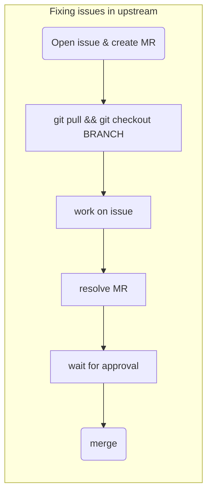
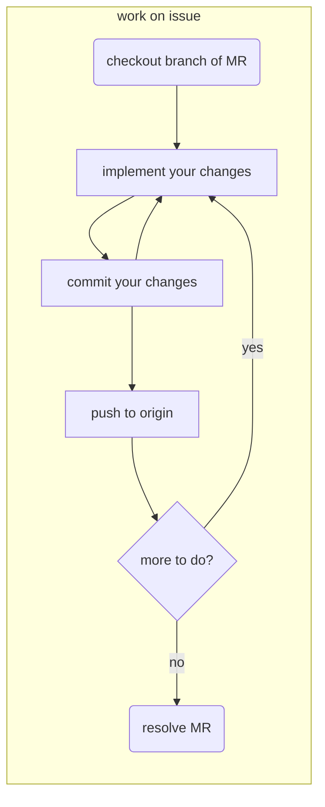
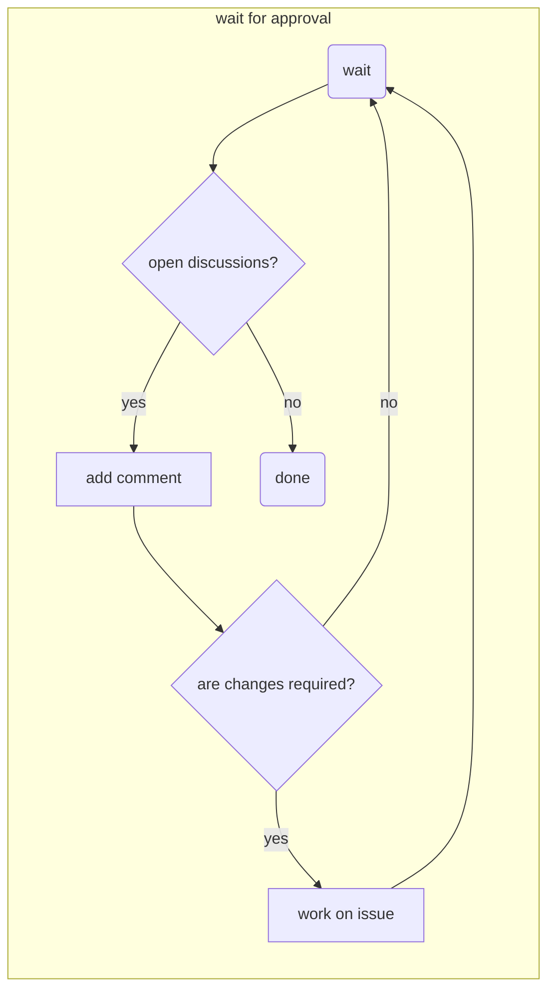

# OPAL Development Workflow

[[_TOC_]]

---

## 1. A short introduction

On this Wiki page we explain the _OPAL_ development workflow for fixing issues, implementing bigger changes and editing the manual. In the last section we explain the scheme we use for versioning.

* file all changes (bugfixes and feature changes) in the [issue tracker](https://gitlab.psi.ch/OPAL/src/issues) of Gitlab
 * all issues have to be assigned to an OPAL version number(to be discussed: maybe better a milestone?) (a certain feature will be implemented in  this version)
 * create a branches for all issues, merge these branches to the desired upstream stable and development branches.

In this document we show you to do each step on the command line. For many IDEs have nativ Git support, for most(?) editors extensions are available, like Magic for Emacs. If you prefer a standalone GUI just Google for something like "git gui".

---

## 2. Terminology

* **upstream repository**  
  In this document we use the term **upstream** repository for the original repository on `gitlab.psi.ch`. The upstream repository for _OPAL_ is `https://gitlab.psi.ch/OPAL/srv` for the manual it is `https://gitlab.psi.ch/OPAL/Documentation/Manual`
* **fork**  
  A **fork** is a complete copy of an upstream repository on `https://gitlab.psi.ch`. Forks are usually located in the users namespace and are created via Gitlabs fork mechanism. We use forks to implement huger chances.
* **origin**  
  In Git, **origin** is a shorthand name for the remote repository that a repository was originally cloned from. This points either to the upstream repository or a forked repository.
* **branch**  
  **Branches** are a basic concept in Git. Usually multiple branches exist in the same Git repository. A **branch** makes it possible to implement changes without impacting other branches. We use branches to separate code for different versions. For example in the _OPAL_ upstream repository we have the branches `OPAL-2.0`, `OPAL2.2`, `master`... Another use-case for branches is to fix bugs, code cleanup and small code changes in general. The lifetime of these branches should be short.
* **protected branches**  
  A **protected branch** is a branch you are **not** allowed to push to. The master branch and all branches for the different versions are protected. Changes to protected branches must be done via merge requests!

---

## 3. Fixing issues in the upstream repository

We use the following workflow to implement smaller changes, code cleanup and bugfixes:

1. Open issue and create merge request (MR)
1. Update your clone and checkout branch created for MR
1. Implement your changes, commit and push frequently
1. Resolve work in progress (WIP) status  of your MR and add at least two approvers (more are better)
1. Wait for approval. As long as discussions are open:
   * answer to comments/suggestions/questions in discussions
   * Implement more/adapt your changes
1. Merge

Same as a flowchart (an experiment with _mermaid_):



### 3.1 Open issue and create merge request

The following steps must be performed in Gitlabs Web GUI:

* Open issue in Gitlabs issue tracker. Select a template for the report. At the time of writing templates for bug reports and feature requests are available. For other issues use "no template".
* It is usually a good idea to create a merge request as soon as you start working on the issue.
  * Merge request for the **master** branch can be created directly via the issue tracker. In this case a new branch and and a request for merging this branch will be created. The merge request will be marked as **WIP** (work in progress).
  * If you want to create a merge request for another branch, you have to create a branch related to the issue yourself. Choose a name for the branch which make the relation to the merge request clear.

### 3.2 Update your clone and checkout branch created for the merge request

On you local copy, run
```
git pull
git checkout BRANCH
```

> **Note:** Maybe you have to commit  your local changes first!

### 3.3 Implement your changes

1. implement your changes, check changes against coding style guide
1. Tell Git which files you would like to commit
   ```
   git add <filename1> <filename2>
   ```
1. Commit the files locally on your development machine
   ```
   git commit -m "Description of changes"
   ```
1. push your changes to Gitlab (optional if you have to implement more changes)
   ```
   git push
   ```
1. go back to 1. if you are not done

Same as _mermaid_ flowchart:



### 3.4 Resolve work in progress (WIP) status  of your MR

Open Gitlabs Web-GUI for the  next steps.

* Open  merge request.
* Resolve **WIP** status
* Edit merge request:
  * add at least two approvers
  * assign merge request to yourself (usually)
  * check the "delete branch" checkbox (there are only few cases where you don't want this)

### 3.5 Wait for approval. As long as discussions are open:
   * answer to comments/suggestions/questions in discussions
   * Implement more/adapt your changes



### 3.6 Merge

After all discussions are closed and the merge request has been approved, you can merge it. Merging **must** be done in Gitlab!

---

## 4. Develop a new OPAL Feature

Huge changes like OPAL3d should be done in a fork. This includes all student work like Master- and PhD. thesis.

> It is good practice to use the issue tracker and merge request in your fork.

> Merge changes from your fork to the upstream repository, when the work is **done** or something **usable** is available. 

**Setup:**

1. Open an issue in the [OPAL project](https://gitlab.psi.ch/OPAL/src)
1. Create a fork on Gitlab.
1. Create a new branch in your fork on Gitlab. This is the branch you have to work on. Do *not* work on the master-branch!
1. Create a local clone.
1. Checkout the branch created in step 3.

**Implement:**

1. Code your feature
1. Commit and push to your fork frequently
1. Frequently fetch changes from upstream master to your master and merge to your branch.
1. Go back to 1. till you are done

**Merge:**

1. Create a merge request in the [_OPAL_ project](https://gitlab.psi.ch/OPAL/src), select at least two approvers and resolve work in progress (WIP) status.
1. Wait for approval, depending on the discussions changes might be required (they usually are).
1. Merge your changes

In the next sections these steps are explained in more detail.

### 4.1 Create a fork

1. Open the [OPAL project](https://gitlab.psi.ch/OPAL/src) and push the fork button
1. Select a group you want to fork into. (to be discussed: do we want to keep all forks in a sub-group of OPAL? Like https://gitlab.psi.ch/OPAL/src/Forks.)
1. Wait till the creation of the fork completes.

### 4.2 Create a local clone of your fork

1. On your development machine, copy the URI of your fork to the clip board and clone it:  
   ```
   git clone <new repository>
   ```
1. Change into the cloned repository and add the upstream repository as a _remote_   
   ```
   git remote add upstream git@gitlab.psi.ch:OPAL/src
   ```   

### 4.3 Workflow while implementing the new feature

It's a good practice 
* to commit and push your changes frequently.
* to merge from the upstream repository often.
* use the issue tracker and merge request (no approvers are required for merge request in your fork)

The workflow is basically the same as for fixing issues in an upstream branch. In addition you have to merge changes from the upstream repository.

The workflow to merge changes from upstream is

1. Fetch changes from upstream  
   ```
   git fetch
   ```
1. Merge changes from upstream
   ```
   git merge upstream/master
   ```
1. Resolve conflicts, if any

> If your upstream branch is not `master`, replace it with the correct branch.

### 4.4 Merge changes from your fork to the upstream repository

1. Open a new merge request in the [_OPAL_ project](https://gitlab.psi.ch/OPAL/src).
2. Select the group of the fork and your working branch as source branch and submit the request.
3. Select at least to approvers and resolve the merge request.
4. Discuss your changes with the approvers, maybe you have to implement some changes.  
  > After committing new changes the request must be (re-)approved by all approvers.
5. After all discussions are closed you can merge the request.


### 4.5 Links

https://www.atlassian.com/git/tutorials/git-forks-and-upstreams

## 5. _OPAL_ Manual

For the manual we use the same workflow as for fixing issues in the master branch. The only difference is that merge request _requires_ no approval - it many cases asking for approval is a good idea anyway.

## 6. Versioning

* **Major version number**  
  * no incompatible changes in the input file
  * no incompatible changes in the output files

* **Minor version number**  
  * stable versions have an even minor version number (like 1.4.0)
  * development version have an odd minor version number (like 1.5.0)

* **The third number in a version number**  
  * identify bugfixes and feature changes (like 1.4.1)

* **Stable versions**  
  * only bugfixes and small feature changes are done in a stable version
  * development for a stable version is done in a branch named OPAL-$MAJOR_VERSION.$MINOR_VERSION

* **Development versions**  
  * development is done in the 'master' branch.
  * increase the third number in the version frequently to reflect changes (either bugfixes or new features)
