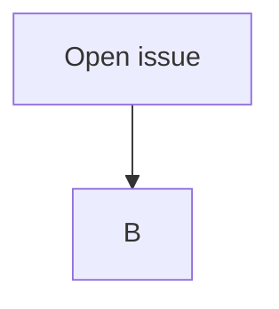

# OPAL Development Workflow

[[_TOC_]]

## Fixing issues in upstream

1. Open issue
2. Create merge request (MR)
3. Update your clone
4. Checkout branch created for MR
5. Implement your changes, don't forget to commit and push frequently
1. Resolve work in progress (WIP) status  of your MR and add at least two approvers (more are better)
1. Wait for approval. As long as discussions are open:
   * answer to comments/suggestions/questions in discussions
   * Implement more/adapt your changes
1. Merge



## Develop a new OPAL Feature

In OPAL, each developer works in a fork of the central repository inside your personal group or the OPAL group. When the development is done, the code is merged back into the central repository.

To develop a new feature for a given OPAL project, you have to

1. Create a fork
1. Clone and setup the clone
1. Code your feature
1. Merge your changes into central repository

In the next sections these steps are explained in more detail.

### Create a fork

1. From the [OPAL group](https://gitlab.psi.ch/OPAL) on PSI's Gitlab, select the project (e.g.
[`src`](https://gitlab.psi.ch/OPAL/src))
1. This will take you to a page showing the URI for cloning the repository and a few other options. 
1. Next to the URI there is a button marked `fork`; click on it.
1. You can build a fork in groups of which you are a member, or in your personal group, which is named after your username. Create the fork in your personal group. `Forking in progress` appears. Now wait (this can take a few minutes). If the fork has been created successfully, a URI to the new fork should be shown.

### Clone your fork and setup clone

1. On your development machine, copy the URI of your fork to the clip board and clone it:  
   ```
   git clone <new repository>
   ```
1. Change into the cloned repository and add the central repository as a _remote_   
   ```
   git remote add upstream <original repository>
   ```   
   *Example:*
   for OPAL the source repository the command is
   ```
   git remote add upstream git@gitlab.psi.ch:OPAL/src.git
   ```

### Workflow while implementing the new feature

Write some code. It's a good idea to frequently commit code, and to merge from the upstream repository often. When you are ready to put the code back into the upstream repository:

1. Check changes against coding style guide
1. Tell Git which files you would like to commit
   ```
   git add <filename1> <filename2>
    ```
1. Commit the files locally on your development machine
   ```
   git commit -m "Description of changes"
   ```
1. Merge changes from upstream
   ```
   git merge upstream
   ```
1. If there are conflicts, you may need to modify the codel then go back through the ```git add``` and ```git commit``` process. 
1. Check that everything builds and tests pass
1. When you are ready, push your code back to Gitlab by doing
   ```
   git push
   ```

### Merge your new feature into central repository

* In your branch, click on the ```merge request``` link and select a reviewer from the list.
* The reviewer will determine if the code is okay to merge. 
* The reviewer clicks ```accept merge request``` and the code is merged back to the upstream repository; now watch the nightly builds...