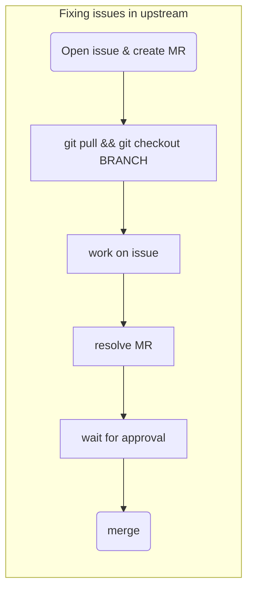
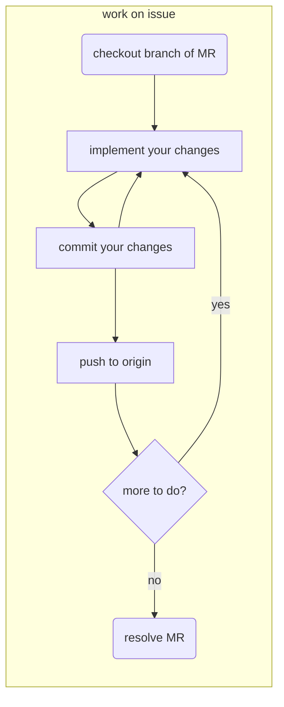
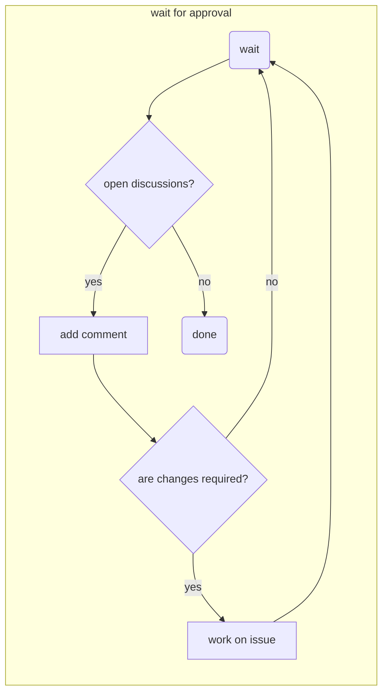

# OPAL Development Workflow

[[_TOC_]]

## A very short introduction

On this Wiki page we explain the _OPAL_ development workflow for fixing issues, implementing bigger changes and editing the manual. In the last section we explain the scheme we use for versioning.

In this document we show you to do each step on the command line. For many IDEs have nativ Git support, for most(?) editors extensions are available, like Magic for Emacs. If you prefer a standalone GUI just Google for something like "git gui".

## Some terminology

* **central repository**  
  In this document we use the term **central** repository for the original repository on `gitlab.psi.ch`. The central repository for _OPAL_ is `https://gitlab.psi.ch/OPAL/srv` for the manual it is `https://gitlab.psi.ch/OPAL/Documentation/Manual`
* **fork**  
  A **fork** is a complete copy of an central repository on `https://gitlab.psi.ch`. Forks are usually located in the users namespace and are created via Gitlabs fork mechanism. We use forks to implement huger chances.
* **origin**  
  In Git, **origin** is a shorthand name for the remote repository that a repository was originally cloned from. This points either to the upstream repository or a forked repository.
* **upstream**  
  TBW
* **branch**  
  **Branches** are a basic concept in Git. Usually multiple branches exist in the same Git repository. A **branch** makes it possible to implement changes without impacting other branches. We use branches to separate code for different versions. For example in the _OPAL_ upstream repository we have the branches `OPAL-2.0`, `OPAL2.2`, `master`... Another use-case for branches is to fix bugs, code cleanup and small code changes in general. The lifetime of these branches should be short.
* **protected branches**  
  A **protected branch** is a branch you are **not** allowed to push to. The master branch and all branches for the different versions are protected. Changes to protected branches must be done via merge requests!

## Fixing issues in central repository

We use the following workflow to implement smaller changes, code cleanup and bugfixes:

1. Open issue and create merge request (MR)
1. Update your clone and checkout branch created for MR
1. Implement your changes, commit and push frequently
1. Resolve work in progress (WIP) status  of your MR and add at least two approvers (more are better)
1. Wait for approval. As long as discussions are open:
   * answer to comments/suggestions/questions in discussions
   * Implement more/adapt your changes
1. Merge

Same as a flowchart (an experiment with _mermaid_):



### Open issue and create merge request

The following steps must be performed in Gitlabs Web GUI:

* Open issue in Gitlabs issue tracker. Select a template for the report. At the time of writing templates for bug reports and feature requests are available. For other issues use "no template".
* It is usually a good idea to create a merge request as soon as you start working on the issue.
  * Merge request for the **master** branch can be created directly via the issue tracker. In this case a new branch and and a request for merging this branch will be created. The merge request will be marked as **WIP** (work in progress).
  * If you want to create a merge request for another branch, you have to create a branch related to the issue yourself. Choose a name for the branch which make the relation to the merge request clear.

### Update your clone and checkout branch created for the merge request

On you local copy, run
```
git pull
git checkout BRANCH
```

> **Note:** Maybe you have to commit  your local changes first!

### Implement your changes

1. implement your changes, check changes against coding style guide
1. Tell Git which files you would like to commit
   ```
   git add <filename1> <filename2>
   ```
1. Commit the files locally on your development machine
   ```
   git commit -m "Description of changes"
   ```
1. push your changes to Gitlab (optional if you have to implement more changes)
   ```
   git push
   ```
1. go back to 1. if you are not done

Same as _mermaid_ flowchart:



### Resolve work in progress (WIP) status  of your MR

Open Gitlabs Web-GUI for the  next steps.

* Open  merge request.
* Resolve **WIP** status
* Edit merge request:
  * add at least two approvers
  * assign merge request to yourself (usually)
  * check the "delete branch" checkbox (there are only few cases where you don't want this)

### Wait for approval. As long as discussions are open:
   * answer to comments/suggestions/questions in discussions
   * Implement more/adapt your changes



### Merge

After all discussions are closed and the merge request has been approved, you can merge it. Merging **must** be done in Gitlab!  

## Develop a new OPAL Feature

In OPAL, each developer works in a fork of the central repository inside your personal group or the OPAL group. When the development is done, the code is merged back into the central repository.

To develop a new feature for a given OPAL project, you have to

1. Create a fork
1. Clone and setup the clone
1. Code your feature
1. Merge your changes into central repository

In the next sections these steps are explained in more detail.

### Create a fork

1. From the [OPAL group](https://gitlab.psi.ch/OPAL) on PSI's Gitlab, select the project (e.g.
[`src`](https://gitlab.psi.ch/OPAL/src))
1. This will take you to a page showing the URI for cloning the repository and a few other options. 
1. Next to the URI there is a button marked `fork`; click on it.
1. You can build a fork in groups of which you are a member, or in your personal group, which is named after your username. Create the fork in your personal group. `Forking in progress` appears. Now wait (this can take a few minutes). If the fork has been created successfully, a URI to the new fork should be shown.

### Clone your fork and setup clone

1. On your development machine, copy the URI of your fork to the clip board and clone it:  
   ```
   git clone <new repository>
   ```
1. Change into the cloned repository and add the central repository as a _remote_   
   ```
   git remote add upstream <original repository>
   ```   
   *Example:*
   for OPAL the source repository the command is
   ```
   git remote add upstream git@gitlab.psi.ch:OPAL/src.git
   ```

### Workflow while implementing the new feature

Write some code. It's a good idea to frequently commit code, and to merge from the upstream repository often. When you are ready to put the code back into the upstream repository:

1. Check changes against coding style guide
1. Tell Git which files you would like to commit
   ```
   git add <filename1> <filename2>
    ```
1. Commit the files locally on your development machine
   ```
   git commit -m "Description of changes"
   ```
1. Merge changes from upstream
   ```
   git merge upstream
   ```
1. If there are conflicts, you may need to modify the codel then go back through the ```git add``` and ```git commit``` process. 
1. Check that everything builds and tests pass
1. When you are ready, push your code back to Gitlab by doing
   ```
   git push
   ```

### Merge your new feature into central repository

* In your branch, click on the ```merge request``` link and select a reviewer from the list.
* The reviewer will determine if the code is okay to merge. 
* The reviewer clicks ```accept merge request``` and the code is merged back to the upstream repository; now watch the nightly builds...